# 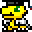 Digitask

<div align="center">
  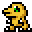
  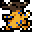
  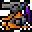
  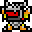
  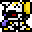
</div>

<div align="center">
  <h3>A Productivity App Where Your Digimon Grows With Your Success</h3>
  <p>Complete tasks, evolve your Digimon, and grow your party</p>
</div>

---

## 🌟 What is Digitask?

Digitask is a productivity application that combines the concept of virtual pets with real-world task management. Your virtual pet's health, level, and evolution are directly tied to your productivity and task completion. The more productive you are, the stronger your Digimon becomes!

<div align="center">
  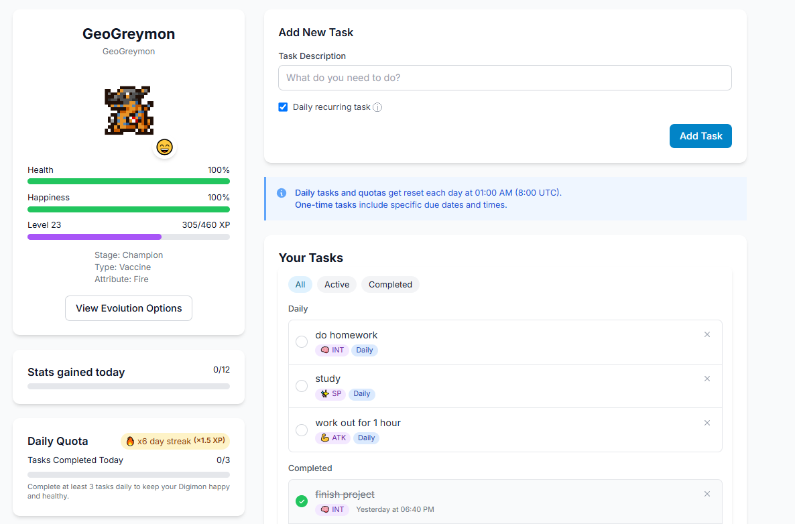
</div>

---

## Core Features

### 🏆 **Task Management System**
- **Three Task Types**: One-time, Daily, and Recurring tasks
- **Smart Categorization**: Tasks automatically detect categories (HP, SP, Attack, Defense, Speed, Intelligence)
- **Streak Tracking**: Maintain daily quotas for experience multipliers (up to 2.5x!)
- **Visual Progress**: Watch your productivity streaks grow

### 🐾 **Digimon Growth & Evolution**
- **Real Digimon**: Over 300+ Digimon to discover and collect
- **Evolution System**: Evolve your Digimon through multiple stages (Baby → In-Training → Rookie → Champion → Ultimate → Mega → Ultra)
- **Stat Development**: Train specific stats through categorized tasks
- **Multiple Digimon**: Raise a team of up to 6 Digimon simultaneously

<div align="center">
  
  
  
  
  
</div>

### ⚔️ **Battle System**
- **Team Battles**: Assemble teams of 3 Digimon for battles
- **Arena Battles**: Compete against other players' teams
- **Weekly Boss Raids**: Challenge powerful bosses for rare rewards
- **Campaign Mode**: Test your team against 80+ stages

### 🏅 **Achievement & Title System**
- **Titles**: Unlock titles like "DigiDestined", "Battle Champion", "Perfect Partner"
- **Milestones**: Track your progress with detailed statistics
- **Leaderboards**: Compete with other players globally
- **Collection**: Discover and catalog all Digimon species

### 🎨 **Visual Features**
- **Pixel-Perfect Sprites**: Authentic Digimon sprites with smooth animations
- **Dark/Light Themes**: Customizable UI themes
- **Responsive Design**: Works perfectly on mobile and desktop
- **Evolution Animations**: Dynamic evolution sequences

---

## 🛠️ Tech Stack

<div align="center">

| Frontend | Backend | Database | Tools |
|----------|---------|----------|-------|
|  |  |  |  |
|  |  |  |  |
|  |  |  |  |

</div>

### **Key Dependencies**
- **State Management**: Zustand for lightweight, scalable state management
- **UI Components**: Radix UI for accessible, customizable components
- **Animations**: Framer Motion for smooth, engaging animations
- **Routing**: React Router for seamless navigation
- **Styling**: Tailwind CSS with custom design system
- **AI Integration**: OpenAI GPT-3.5 for intelligent Digimon assistant (Bokomon)

---

## 🚀 Getting Started

### **Prerequisites**
- Node.js (v18 or later)
- npm or yarn
- Supabase account
- Git

### **Installation**

1. **Clone the repository**
   ```bash
   git clone https://github.com/kkhuu131/digitask.git
   cd digitask
   ```

2. **Install dependencies**
   ```bash
   npm install
   ```

3. **Environment Setup**
   Create a `.env` file in the root directory:
   ```env
   VITE_SUPABASE_URL=your_supabase_url
   VITE_SUPABASE_ANON_KEY=your_supabase_anon_key
   OPENAI_API_KEY=your_openai_api_key
   ```

4. **Database Setup**
   - Create a new Supabase project
   - Run the SQL from `supabase/schema.sql` in the SQL editor
   - Set up Row Level Security (RLS) policies

5. **Start Development Server**
   ```bash
   npm run dev
   ```

6. **Open your browser**
   Navigate to `http://localhost:5173`

---

## 🎯 How to Play

### **Getting Started**
1. **Create Account**: Sign up with email or social login
2. **Choose Your Partner**: Select from 5 different baby Digimon
3. **Create Tasks**: Add real-life tasks with categories
4. **Complete Tasks**: Watch your Digimon grow stronger
5. **Evolve**: Meet requirements to evolve to stronger forms

### **Task Categories & Stats**
<div align="center">

| Category | Stat Boost | Example Tasks |
|----------|------------|---------------|
| 🏃‍♂️ **Physical** | HP & Attack | "Go to gym", "Run 5km", "Do push-ups" |
| 🧠 **Mental** | Intelligence | "Study for 2 hours", "Read a book", "Learn coding" |
| ⚡ **Speed** | Speed | "Complete work quickly", "Practice typing" |
| 🛡️ **Defense** | Defense | "Meditate", "Get enough sleep", "Eat healthy" |
| 💪 **Spirit** | SP | "Practice mindfulness", "Help others" |

</div>

### **Evolution Requirements**
- **Level Requirements**: Each evolution needs specific levels
- **Stat Requirements**: Meet minimum stat thresholds
- **Special Items**: Some evolutions require rare items
- **Multiple Paths**: Choose from different evolution branches

---

## 🏗️ Project Structure

```
digitask/
├── 📁 src/
│   ├── 📁 components/          # Reusable UI components
│   │   ├── 📁 bokomon-assistant/  # AI chat assistant
│   │   ├── Digimon.tsx         # Digimon display component
│   │   ├── TaskList.tsx        # Task management
│   │   └── ...
│   ├── 📁 pages/               # Route components
│   │   ├── Dashboard.tsx       # Main dashboard
│   │   ├── Battle.tsx          # Battle system
│   │   ├── DigimonDexPage.tsx  # Digimon encyclopedia
│   │   └── ...
│   ├── 📁 store/               # Zustand state management
│   │   ├── authStore.ts        # Authentication
│   │   ├── petStore.ts         # Digimon management
│   │   ├── taskStore.ts        # Task management
│   │   └── ...
│   ├── 📁 utils/               # Utility functions
│   └── 📁 types/               # TypeScript definitions
├── 📁 public/assets/           # Static assets
│   ├── 📁 digimon/            # Digimon sprites (300+)
│   ├── 📁 animated_digimon/   # Animated sprites (8000+)
│   ├── 📁 items/              # Game items
│   └── 📁 type-attribute/     # Type/attribute icons
├── 📁 supabase/               # Database schema
├── 📁 api/                    # Vercel API routes
└── 📁 scripts/                # Data generation scripts
```

---

## Game Features

### **Digimon Management**
- **Active Digimon**: One primary Digimon that gains full EXP
- **Team Building**: Up to 6 Digimon in your collection
- **Switching**: Change active Digimon anytime
- **Storage**: Non-active Digimon gain 30% EXP

### **Battle System**
- **Turn-Based Combat**: Strategic battles with type advantages
- **Team Composition**: Build teams with synergy
- **Wild Battles**: Random encounters for EXP
- **PvP Battles**: Compete against other players
- **Boss Raids**: Weekly challenging encounters

### **Evolution System**
- **7 Stages**: Baby → In-Training → Rookie → Champion → Ultimate → Mega → Ultra
- **Branching Paths**: Multiple evolution options
- **Devolution**: Return to previous forms
- **Special Requirements**: Items, specific Digimon, or conditions

### **Social Features**
- **Leaderboards**: Global rankings
- **User Profiles**: Showcase your achievements
- **Battle History**: Track your victories
- **Friend System**: Connect with other players

---

## 🎨 Visual Showcase

<div align="center">
  
  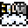
  
  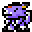
  
  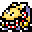
  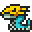
</div>

<div align="center">
  
  
  
  
</div>

---

## 🏆 Achievement System

### **Title Categories**
- **🏅 Campaign**: Story progression titles
- **📚 Collection**: Digimon discovery titles  
- **🔄 Evolution**: Evolution achievement titles
- **⚔️ Battle**: Combat victory titles
- **🔥 Streak**: Consistency achievement titles

### **Tier System**
- **🥉 Bronze**: Beginner achievements
- **🥈 Silver**: Intermediate achievements  
- **🥇 Gold**: Advanced achievements
- **💎 Platinum**: Legendary achievements

---

## 🚀 Deployment

### **Vercel Deployment**
1. Connect your GitHub repository to Vercel
2. Set environment variables in Vercel dashboard
3. Deploy automatically on push to main branch

### **Environment Variables**
```env
VITE_SUPABASE_URL=your_supabase_url
VITE_SUPABASE_ANON_KEY=your_supabase_anon_key
OPENAI_API_KEY=your_openai_api_key
```

<div align="center">
  
  [](https://vercel.com/new/clone?repository-url=https://github.com/kkhuu131/digitask)
  
  <p>
    <a href="#-digitask">⬆️ Back to Top</a>
  </p>
</div>