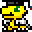
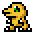
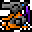

#  Digitask

<div align="center">
  
  
  
  
  
</div>

<div align="center">
  <h3>A productivity app where completing real-life tasks grows your Digimon</h3>
</div>

---

## Table of Contents

- [What It Does](#what-it-does)
- [Tech Stack](#tech-stack)
- [Running Locally](#running-locally)
- [Environment Variables](#environment-variables)
- [Project Structure](#project-structure)
- [Core Features](#core-features)
- [Architecture Notes](#architecture-notes)
- [Data Generation Scripts](#data-generation-scripts)
- [Database Overview](#database-overview)

---

## What It Does

Digitask is a gamified productivity app. Users manage a party of Digimon virtual pets whose strength is directly tied to real-life task completion. Every completed task fires a Supabase RPC that awards EXP and trains one of six stats (HP, SP, ATK, DEF, INT, SPD) on the user's active Digimon. Stronger Digimon unlock higher evolutionary stages and perform better in arena battles and weekly tournaments against other users' teams.

**Core loop:**
1. Create tasks with a category, difficulty, and priority
2. Complete tasks → Digimon earns EXP and stat points
3. Level up → meet evolution requirements → Digimon evolves
4. Field evolved Digimon in arena battles and weekly tournaments
5. Earn achievements and claim DigiEgg rewards (new Digimon to raise)

---

## Tech Stack

| Layer | Library / Service | Version |
|-------|------------------|---------|
| UI framework | React | 18.3 |
| Language | TypeScript | 5.8 |
| Build / dev server | Vite | 5.4 |
| Routing | React Router | 6.30 |
| State management | Zustand | 4.5 |
| Styling | Tailwind CSS | 3.4 |
| Animations | Framer Motion | 10.18 |
| Backend / Auth / DB | Supabase (Postgres + Auth + Realtime) | 2.49 |
| AI assistant (dev only) | OpenAI SDK | 5.3 |
| Dev middleware | Express + Cors | 5.1 / 2.8 |
| Drag-and-drop | dnd-kit | 6.3 |
| Icons | Lucide React | 0.514 |
| Activity heatmap | react-calendar-heatmap | 1.10 |

---

## Running Locally

### Prerequisites

- **Node.js 18+**
- A **Supabase project** with the schema applied (tables, RLS policies, stored procedures/RPCs — the app depends heavily on server-side functions)

### Steps

**1. Clone and install**

```bash
git clone https://github.com/kkhuu131/digitask.git
cd digitask
npm install
```

**2. Create `.env`** in the project root (see [Environment Variables](#environment-variables))

**3. Start the dev server**

```bash
npm run dev
```

This starts the Vite dev server on `http://localhost:5173` and also mounts the Bokomon AI assistant endpoint at `/api/bokomon` via a Vite plugin. The middleware is loaded dynamically so it never enters the production bundle.

**4. Open the app**

Navigate to `http://localhost:5173`. Unauthenticated users see the landing page. After sign-in, new users are routed through onboarding to choose a starter Digimon; returning users land on the dashboard.

### Other Commands

```bash
npm run build         # tsc type-check + Vite production build → dist/
npm run preview       # Serve the production build locally
npm run lint          # ESLint — zero warnings enforced
npm run format        # Prettier — format all src/ files in-place
npm run format:check  # Prettier — check formatting (used by CI)
npm test              # Vitest — run all tests once (CI mode)
npm run test:watch    # Vitest — watch mode for development
npm run test:coverage # Vitest — run tests with coverage report
```

---

## Environment Variables

Create a `.env` file at the project root:

```env
# Required — Supabase project credentials (browser-safe, VITE_ prefix exposes them to the client)
VITE_SUPABASE_URL=https://<project-ref>.supabase.co
VITE_SUPABASE_ANON_KEY=<your-anon-key>

# Required for Bokomon AI assistant — consumed only by the Vite dev middleware, never bundled
VITE_OPENAI_API_KEY=sk-<your-openai-key>

# Required only when running data-generation scripts — never exposed to the browser
SUPABASE_SERVICE_ROLE_KEY=<your-service-role-key>
```

`VITE_SUPABASE_URL` and `VITE_SUPABASE_ANON_KEY` are validated at startup in `src/lib/supabase.ts`; the app throws immediately if either is missing.

`VITE_OPENAI_API_KEY` is read by `src/server/middleware.ts` inside the Vite plugin only — it does not appear in `dist/`. In production, `/api/bokomon` returns a 404/no-op.

---

## Project Structure

```
digitask/
├── public/
│   └── assets/
│       ├── animated_digimon/     # Per-Digimon sprite sheets (idle, attack, happy, sad, etc.)
│       └── digimon/              # Static dot sprites used in battle/dex
├── scripts/                      # Node scripts to regenerate src/constants/ from the DB
├── src/
│   ├── App.tsx                   # Root router, sequential app init, protected route guards
│   ├── api/
│   │   └── bokomonHandler.ts     # OpenAI-backed Bokomon chat handler (dev only)
│   ├── components/               # Shared and feature-level UI components
│   ├── constants/                # Pre-generated static lookup tables (not live DB queries)
│   ├── hooks/                    # Custom React hooks
│   ├── lib/
│   │   └── supabase.ts           # Supabase client singleton
│   ├── pages/                    # Route-level page components
│   ├── server/
│   │   └── middleware.ts         # Vite dev-server middleware for /api/bokomon
│   ├── store/                    # Zustand stores — one per domain
│   ├── types/                    # Shared TypeScript interfaces
│   └── utils/                    # Pure logic: stat calc, evolution helpers, sprite manager
└── vite.config.ts
```

### Routes

| Path | Page | Auth required |
|------|------|:---:|
| `/` | Dashboard (or LandingPage if logged out) | ✓ |
| `/landing` | LandingPage | — |
| `/login` | Login | — |
| `/register` | Register | — |
| `/forgot-password` | ForgotPassword | — |
| `/reset-password` | ResetPassword | — |
| `/auth/callback` | AuthCallback | — |
| `/digimon-dex` | DigiDex encyclopedia | ✓ |
| `/battle` | Arena battle hub + battle interface | ✓ |
| `/tournament` | Weekly bracket tournament | ✓ |
| `/digifarm` | Party and storage management | ✓ |
| `/store` | Neemon's Shop (items / stat boosters) | ✓ |
| `/achievements` | Achievements and title claiming | ✓ |
| `/roster` | Full owned-Digimon roster with filters | ✓ |
| `/profile` | Current user profile | ✓ |
| `/profile/user/:id` | View another user by ID | ✓ |
| `/profile/name/:username` | View another user by username | ✓ |
| `/leaderboard` | Global rankings | ✓ |
| `/user-search` | Find other players | ✓ |
| `/settings` | User preferences | ✓ |
| `/tutorial` | Game mechanics guide | ✓ |
| `/patch-notes` | Changelog / update info | ✓ |
| `/onboarding` | First-time user flow | ✓ |
| `/create-pet` | Choose and name starter Digimon | ✓ |
| `/admin/reports` | Manage abuse reports | admin |
| `/admin/user-digimon` | Inspect / edit user Digimon | admin |
| `/admin/digimon-manager` | Manage Digimon species data | admin |
| `/admin/tournament-teams` | Manage tournament templates | admin |
| `/admin/titles` | Manage title definitions | admin |
| `/debug` | Dev tools | dev only |

---

## Core Features

### Task System

Tasks carry a `category` (HP/SP/ATK/DEF/INT/SPD), `difficulty` (easy/medium/hard), `priority` (low/medium/high), optional `due_date`, and an optional `recurring_days` schedule for repeating tasks. Completing a task calls the `complete_task_all_triggers` Supabase RPC, which atomically:

- Marks the task complete and updates `daily_quotas.completed_today`
- Awards EXP to all party Digimon — active: 100%, reserve party: 50%, storage: 0%
- Applies multiplicative EXP modifiers: difficulty (easy 0.5×, hard 1.5×), priority (low 0.75×, high 1.5×), streak (scales up to 2× at an 11+ day streak)
- Allocates one stat point to the task's category on the active Digimon, or saves it to `profiles.saved_stats` if the Digimon has hit its ABI-based bonus stat cap

The **daily quota** requires 3 completed tasks to maintain a streak. A server-side cron runs at PST midnight to apply happiness penalties for uncompleted tasks and advance quota history (powering the activity heatmap).

### Digimon & Stat Progression

Each `user_digimon` row stores a level (1–99), six bonus stats accumulated from task completion, and an `abi` value that controls the total bonus stat cap: `20 + abi`. A `personality` trait (assigned randomly on creation) gives a permanent 5% boost to one stat.

Base stats are interpolated piecewise from species reference values at levels 1, 50, and 99 — the formula is in `src/utils/digimonStatCalculation.ts`. Final stats are `baseStat(level) + bonus + personality_multiplier`.

### Evolution System

Evolution paths (956 entries) are read from `EVOLUTION_LOOKUP_TABLE`, a pre-generated local constant. Paths specify a level threshold, optional stat minimums, optional ABI minimum, optional DNA partner requirement, and optional item requirement. Evolving resets level to 1 and converts pre-evolution level gains into permanent bonus stats. Devolution is allowed to any previously discovered form.

**DNA evolution** (`dna_evolve_digimon` RPC) merges two Digimon and consumes the DNA partner. **Form transformations** (X-Antibody via `digimonFormsLookup.ts`) change a Digimon's form without resetting level.

### Arena Battles

3v3 battles on a hexagonal arena. The player selects a team of up to 3 Digimon and a battle strategy; a simulation runs immediately. Damage formula: `(ATK or INT) / opposing (DEF or INT)` — whichever favors the attacker — multiplied by type matchup, attribute matchup, random variance, and a crit modifier derived from SP.

- **Cost:** 20 energy per battle (energy regenerates at +1 per completed task via `grant_energy_self`)
- **Daily cap:** 5 battles, tracked in `battle_limits`
- **Opponents:** CPU wild teams generated client-side via `generateBattleOption()`, scaled to the user's power rating at easy/medium/hard difficulty
- **First-win daily bonus:** Tracked via `last_arena_first_win` on the user profile

### Weekly Tournament

Single-elimination 3-round bracket tournament. Unlocked by completing 10+ tasks in the current week (tracked optimistically in `tournamentStore`). Opponent teams are CPU-generated from stage-appropriate templates in `src/constants/` and scaled to the user's power rating (sum of weighted stats across the top-3 team). Placement rewards: Top 8 → 100 bits, Top 4 → 300, Runner-up → 600, Champion → 1,500.

### Achievements & Titles

Titles are grouped into six categories (Tasks, Streaks, Battles, Campaign, Collection, Evolution) and four tiers (Bronze, Silver, Gold, Platinum). When an unlock condition is met, `titleStore` inserts a `user_titles` row with `claimed_at = null` and fires a notification. The user visits `/achievements` to claim, which:

1. Sets `claimed_at = NOW()` on `user_titles`
2. Credits bits directly to `user_currency`
3. If the title has a `digiEggPool`, opens a selection modal showing 3 randomly sampled Digimon — the chosen one is added to the user's party (or storage if party is full)

The nav badge counts unclaimed titles via `titleStore.unclaimedCount()`.

### DigiDex

`user_discovered_digimon` tracks every species a user has seen or owned. The `/digimon-dex` page renders a filterable encyclopedia. New Digimon are added on evolution, devolution, and DigiEgg claims.

### Neemon's Shop (`/store`)

Sells stat booster chips, utility items, and avatar unlocks for **bits** (soft currency earned from tasks and achievements). Inventory tracked per-user in `user_inventory`. Item definitions live in `src/constants/storeItems.ts`.

### Party Management (`/digifarm`)

Active party holds up to 9 Digimon; additional Digimon go to storage. Battle teams are a sub-selection of up to 3 party members (`is_on_team: true`). The digifarm page lets users move Digimon between party and storage, set the active Digimon, and review per-Digimon stats and EXP progress.

### Bokomon AI Assistant (dev only)

An in-app AI tutor character backed by OpenAI, accessible at `/api/bokomon` via the Vite dev middleware. Rate-limited to 50 requests/hour per user with a 2-second per-message cooldown. Not included in production builds.

---

## Architecture Notes

### App Initialization Sequence

`App.tsx` runs a sequential, guarded init on mount to avoid race conditions:

1. `checkSession()` — resolves Supabase auth state
2. `checkOnboardingStatus()` — determines whether to show onboarding
3. `initializeStore()` — fetches tasks + daily quota, starts realtime quota subscription
4. `fetchUserDigimon()` — loads active Digimon and party

A module-level `isInitializationInProgress` flag prevents concurrent runs. Auth state changes are debounced 2 seconds and filtered: `INITIAL_SESSION` and `TOKEN_REFRESHED` events are ignored; `SIGNED_IN` only re-initializes if it's a genuinely different user.

### Zustand Store Domains

| Store | Responsibility |
|-------|---------------|
| `authStore` | Supabase session, admin flag, user profile |
| `petStore` | Active Digimon, party/storage, evolution, stat allocation |
| `taskStore` | Task CRUD, daily quota, streak, overdue checks |
| `battleStore` | Battle simulation, opponent generation, energy, daily limit |
| `interactiveBattleStore` | Turn-by-turn interactive battle state |
| `tournamentStore` | Weekly bracket, weekly task count, placement tracking |
| `titleStore` | Achievement unlock logic, DigiEgg claiming |
| `currencyStore` | Bits and DigiCoins balances |
| `inventoryStore` | Item management |
| `notificationStore` | In-app toast queue |
| `themeStore` | Light/dark preference |
| `battleSpeedStore` | Battle animation speed preference |
| `onboardingStore` | First-time user flow state |
| ~~`milestoneStore`~~ | *(Deleted)* Legacy ABI-gated Digimon claiming — superseded by `titleStore` + `AchievementsPage` |

### Local Constants Pattern

Digimon species data (411 entries) and evolution paths (956 entries) change infrequently. Rather than querying Supabase at runtime, this data is pre-generated into TypeScript constants in `src/constants/` and imported directly. This eliminates DB round-trips on every page load. When underlying DB data changes, run the relevant generation script (see below).

### Supabase Patterns

- All DB access goes through the `supabase` singleton from `src/lib/supabase.ts`
- RLS is enforced on every table — the anon key cannot bypass it
- Complex multi-step game actions use DB functions rather than raw client writes, so all mutations are atomic (e.g., `complete_task_all_triggers`, `dna_evolve_digimon`, `spend_energy_self`)
- Realtime subscriptions: `petStore.subscribeToDigimonUpdates()` and `taskStore.subscribeToQuotaUpdates()` keep UI in sync without polling

---

## Data Generation Scripts

These scripts read from Supabase and write TypeScript constant files to `src/constants/`. They require `SUPABASE_SERVICE_ROLE_KEY` in `.env` (except the animated list script, which only reads the filesystem).

```bash
# Regenerate Digimon species data → src/constants/digimonLookup.ts
node scripts/generate-digimon-lookup.js

# Regenerate evolution paths → src/constants/evolutionLookup.ts
node scripts/generate-evolution-lookup.js

# Regenerate form transformations → src/constants/digimonFormsLookup.ts
node scripts/generate-digimon-forms-lookup.js

# Regenerate animated sprite list (reads public/assets/animated_digimon/ folders)
# No DB access needed
node scripts/generate-animated-digimon-list.js

# Generate placeholder pet sprites
npm run generate-placeholders
```

All generated files are marked `// AUTO-GENERATED FILE. DO NOT EDIT DIRECTLY.` at the top. The four generated files are checked into the repo so the app can run without a DB connection for species/evolution data.

| Constant file | Source | Entries |
|---------------|--------|---------|
| `digimonLookup.ts` | `digimon` table | 411 species |
| `evolutionLookup.ts` | `evolution_paths` table | 956 paths |
| `digimonFormsLookup.ts` | `digimon_forms` table | 96 form transforms |
| `animatedDigimonList.ts` | `public/assets/animated_digimon/` | varies |

---

## Database Overview

All tables are in the `public` schema with RLS enabled.

### Key Tables

| Table | Purpose |
|-------|---------|
| `tasks` | User tasks — category, difficulty, priority, due_date, recurrence |
| `digimon` | Species definitions with per-level stat values at levels 1/50/99 |
| `evolution_paths` | Evolution requirements: level, stats, DNA, items |
| `digimon_forms` | X-Antibody and other form transformations |
| `user_digimon` | User-owned Digimon: bonus stats, ABI, personality, is_active, is_on_team, is_in_storage |
| `user_discovered_digimon` | DigiDex — species seen or owned per user |
| `profiles` | User profile: `saved_stats` JSONB, battle energy, highest campaign stage cleared |
| `daily_quotas` | Daily task tracking: `completed_today`, `current_streak`, `longest_streak`, `consecutive_days_missed`, `penalized_tasks` |
| `task_history` | Historical daily task counts — powers the Dashboard activity heatmap |
| `battle_limits` | Per-user daily battle count with last-reset date |
| `team_battles` | Battle records with full turn log as JSONB |
| `user_milestones` | Lifetime task count and streak milestone tracking |
| `titles` | Title definitions (mirrors `src/constants/titles.ts`) |
| `user_titles` | Titles earned per user — `claimed_at` is null until the user claims on Achievements page |
| `user_currency` | Bits (soft) and DigiCoins per user |
| `user_inventory` | Items owned with quantity |
| `admin_users` | Admin whitelist |

### Key RPC Functions

| Function | Called from | Purpose |
|----------|-------------|---------|
| `complete_task_all_triggers(task_id, user_id, auto_allocate)` | `taskStore` | Atomic task completion: mark done, award EXP, allocate stats, update quota |
| `allocate_stat(digimon_id, stat_type, user_id)` | `petStore` | Move one saved stat point to a Digimon's bonus column |
| `dna_evolve_digimon(digimon_id, to_digimon_id, dna_partner_id, boost_points, abi_gain)` | `petStore` | DNA evolution — consumes the partner Digimon |
| `check_and_increment_battle_limit()` | `battleStore` | Increment daily battle count; enforces 5/day cap |
| `check_and_set_first_win_self()` | `battleStore` | Claim the daily first-win arena bonus |
| `spend_energy_self(amount)` | `battleStore`, battle pages | Deduct battle energy from the calling user |
| `grant_energy_self(amount)` | `taskStore` | Add battle energy (+1 per completed task) |
| `is_admin()` | `authStore` | Check if the calling user is in `admin_users` |

### Server-Side Cron Jobs

| Function | Schedule | Purpose |
|----------|----------|---------|
| `reset_daily_tasks()` | Nightly (PST midnight) | Reset `is_completed` on daily/recurring tasks; apply −5 happiness per uncompleted task |
| `process_daily_quotas()` | Nightly (PST midnight) | Archive `completed_today` to `task_history`, reset quotas, break streaks on missed days |
